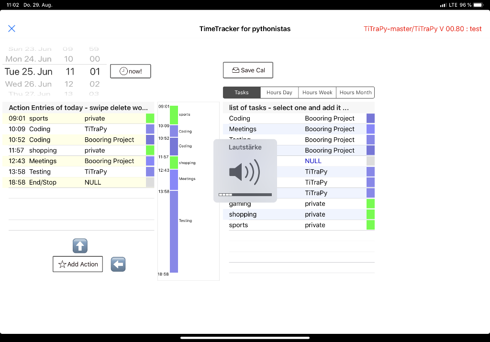
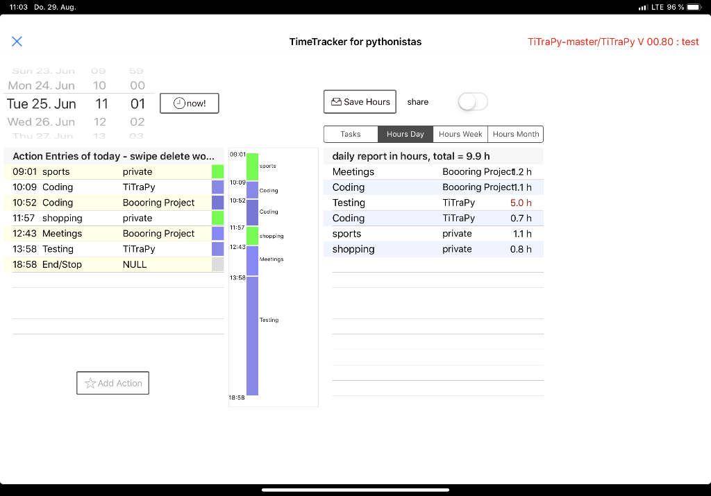

# Documentation and user manual for **TiTraPy**

**Ti**me**Tra**cking**Py**thon Tool / Application for phytonistas

Version 00.80 = pre release

# Goals

* Build a framework of classes to modell projects, tasks in that projects and finaly action, meaning time spent in that tasks. Those actions will be collected in a calender class
  * Calender should calculate hours spend in projects per day, week, month
* Build a UI in pythonista to work with those classes and show the results

# Usage

## editing and creating of tasks and projects

In the to be published code to test the base classes will be examples how to manage tasks and projects by calling the class methods in python code. 
Its quite simple - i beliefe - but needs to be more usable via gui

Right now there is a work in progress app to edit tasks and projects `TasksProjects.py` with two GUI file `Tasks.pyui` and `Project.pyui` 

## The App

### Reading Files 

At startup the looks for a file `prefix.txt`. If found the prefix for the following three files is set to the content of the first line of the file. If not found `test` is assumend as prefix.

For exploring the app `test` as prefix is perfect, because therefore example files exist.

In the next step three files will be read by the code:  

* `<prefix>.tasks.json` contains the definition of the tasks including to which project they belong
* `<prefix>.prj.json`contains the definition of projects including a list of tasks (by ID / Number)
* `<prefix>.cal.csv` contains the actions = tasks with given date and time

You can edit these 3 file directly but it's recomended to use `TasksProjects.py` to edit the tasks and projects and the main app code to edit the calender entries.

Starting with without these files should work also, but needs to be tested.

Actions only have a start date / time no duration or ending time. Each tasks ends, when the following tasks starts. Therefore a "Pause/End" tasks with ID==0 is necessary, that indicates idle times or end of (work)day.

### GUI

Main Screen with example data of `test`. Please note only in june are entries to be found! Just dial the datapicker to june.

### Usage: Adding, deleting, viewing actions

At startup, the dattime picker shows the date and time right now. The left pane shows the actions of today and the right pane the selectable tasks.

Begin with selecting one tasks, then push the **Add** button and this will add a action with the selected task and start time from the datetime picker.

Delete actions by swipping left in the left pane.

The button `Save Cal` updates the calender file. This will also happen automaticly, when closing the app with the big X in the left top corner.

Selecting other dates results in updating the panes with the appropriate data.

### Usage: Show work hours

With the selector alterantiv views and contents for the right pane can be choosen. 

With the button on top you can save the reports as `*.csv` in the working directory an choose to use the iOS Share mechanism.

Only in view `Tasks`new entries to the calender are possible.

# Documentation of Classes in TiTra.py

see file [`TiTra.md`](TiTra.md)